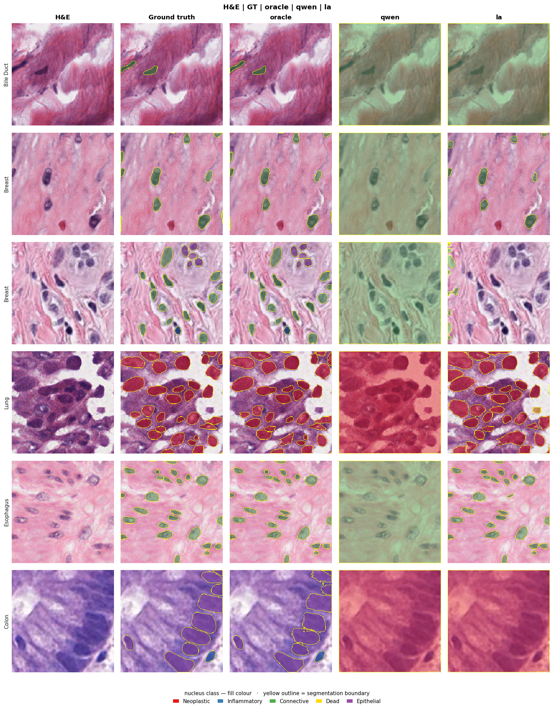
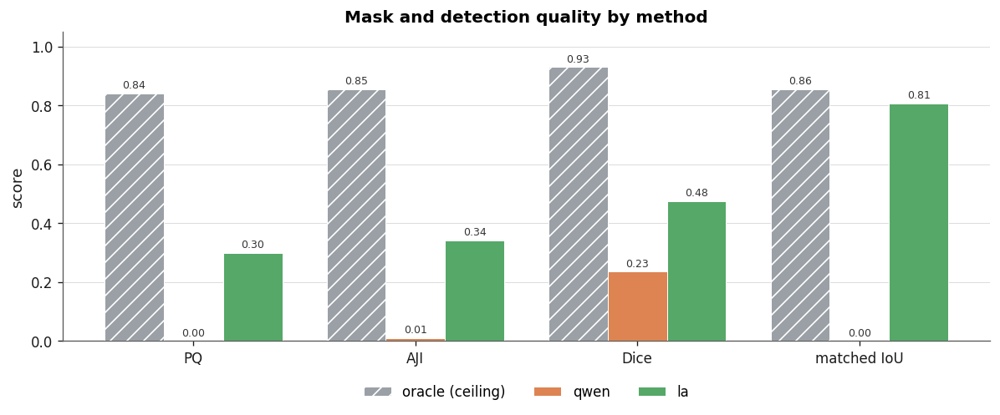
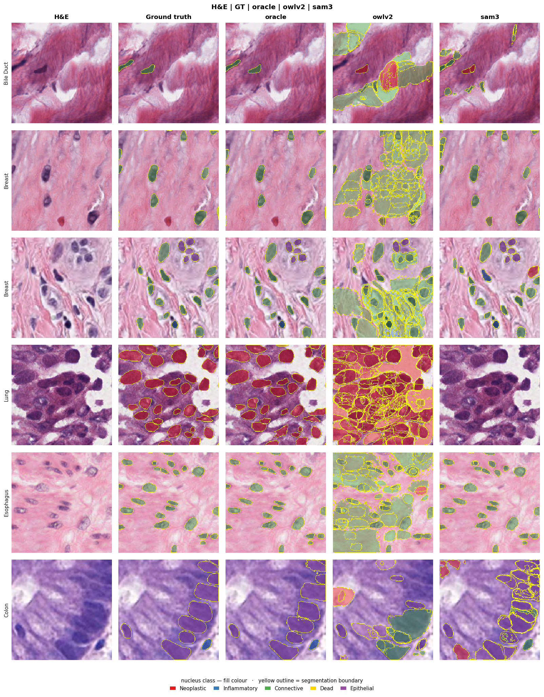
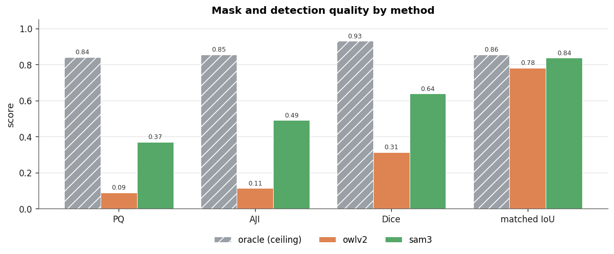

# vlm-medseg

**Benchmarking vision-language and open-vocabulary models for nuclei instance segmentation on PanNuke.**


`vlm-medseg` pairs object localizers — grounding VLMs (LocateAnything-3B,
Qwen2.5-VL), open-vocabulary detectors (Grounding-DINO, OWLv2), and a
ground-truth oracle — with **SAM2** for masks, adds **SAM3** text-prompted
concept segmentation, and scores everything with a decomposed metric suite
(PQ / AJI / Dice / detection F1). An optional post-hoc classifier (frozen
pathology encoder + linear/MLP head) recovers nucleus subtypes. The pipeline,
detectors, segmenters, encoders, and classifier heads are all pluggable, and the
data layer is dataset-agnostic (PanNuke is the reference dataset).

---

## Why

A nuclei pipeline must **find**, **name**, and **segment** each nucleus; a single
score hides which stage fails. `vlm-medseg` separates them and reads every method
against a **ground-truth oracle** that fixes SAM2's segmentation ceiling — so any
shortfall is attributable to detection, segmentation, or classification.

## Features

- **Six conditions** behind one interface: `oracle_box`, `gdino_box`, `owlv2_box`, `qwen_box`, `la_box`, `sam3_text`.
- **SAHI** tiling wrapper for any box detector (helps on dense, tiny nuclei).
- **Decomposed metrics:** PQ / SQ / DQ, per-class mPQ, AJI, Dice, matched-IoU, detection P/R/F1, counting error, class confusion — stratified by class and tissue.
- **Post-hoc nucleus classifier:** frozen encoder (UNI2-h or DINOv3) + trained head; before/after label overlays.
- **Dataset-agnostic core:** add a dataset via `DatasetSpec` + `BaseDataset`.
- **Reproducible runs:** every run writes `results/<method>/` (metrics, predictions, per-patch overlays); detection caching; Kaggle notebooks + local CLI.

## Installation

```bash
git clone https://github.com/marjanstoimchev/vlm-medseg.git
cd vlm-medseg
pip install -e ".[data,sam2,viz,classify,dev]"
```

`torch` / `transformers` live in extras so a bare install stays light and a host's
pre-built CUDA `torch` (e.g. Kaggle) isn't clobbered. LocateAnything-3B is
CUDA-only — run it via the Kaggle notebook (see [`requirements-kaggle.txt`](requirements-kaggle.txt)).

## Quick start

```bash
# SAM2 ceiling on 30 PanNuke patches (local, fast)
python scripts/run_method.py oracle_box --n 30

# Open-vocabulary detector -> SAM2, with tiling
python scripts/run_method.py owlv2_box --n 8 --sahi

# SAM3 text-concept segmentation + post-hoc class correction
python scripts/run_method.py sam3_text --n 8 --threshold 0.2 --classifier uni2h_mlp
```

Each run writes `results/<method>/`: `summary.json`, per-patch `predictions.jsonl`
and `patch_metrics.jsonl`, `config.json`, and `overlays/` (`H&E | GT | prediction`,
or `before | after` with a classifier).

## Usage

### Conditions

| condition | localizer → masker | family |
|---|---|---|
| `oracle_box` | ground-truth boxes → SAM2 | upper bound |
| `gdino_box` | Grounding-DINO → SAM2 | open-vocabulary detection |
| `owlv2_box` | OWLv2 → SAM2 | open-vocabulary detection |
| `qwen_box` | Qwen2.5-VL → SAM2 | grounding VLM (stock) |
| `la_box` | LocateAnything-3B → SAM2 | grounding VLM (fine-tuned, CUDA) |
| `sam3_text` | SAM3 text concept | concept segmentation (end to end) |

### `run_method.py` arguments

| argument | default | description |
|---|---|---|
| `method` | — | one of the conditions above (positional) |
| `--dataset` | `pannuke` | registered dataset name |
| `--fold` | `fold1` | dataset split |
| `--n` | `20` | number of patches (stratified across tissues) |
| `--seed` | `0` | sampling seed |
| `--device` | `auto` | `auto` / `mps` / `cuda` / `cpu` |
| `--model` | per method | override the model id |
| `--sam2-model` | `facebook/sam2-hiera-large` | SAM2 checkpoint (box methods) |
| `--iou` | `0.5` | IoU threshold for matching / PQ |
| `--threshold` | `0.3` | SAM3 detection threshold |
| `--input-short-size` | per method | upscale short side before the VLM (`qwen` 896, `la` 1024) |
| `--sahi` | off | tile the patch before the detector and NMS-merge |
| `--tile` / `--overlap` | `128` / `0.25` | SAHI tile size / overlap |
| `--classifier` | none | probe path or bare name → `models/classifiers/<name>.joblib` |
| `--no-class-aware` | off | class-agnostic (binary) prompts |
| `--max-overlays` / `--gallery-rows` | `12` / `6` | overlay rendering limits |
| `--out` | `results/<method>` | output directory |

### Post-hoc nucleus classifier

Segment class-agnostically, then classify each mask from its pixels with a frozen
pathology encoder + a trained head:

```bash
# 1) curate features (UNI2-h default; --encoder dinov3 also available)
python scripts/curate_classifier_data.py --fold fold2 --n 80 --max-per-class 6000
# 2) train a head (default MLP) -> models/classifiers/<encoder>_<head>.joblib
python scripts/train_classifier.py --features data/classifier/uni2h_fold2.npz
# 3) use it: --classifier uni2h_mlp
```

Curation uses class-balanced `StratifiedKFold` splits; the held-out fold run
through the pipeline is the honest test. The CLI (`vlm-medseg`) also exposes
`sample`, `oracle`, `eval-cache`, and `report` subcommands.

### Notebooks ([`notebooks/`](notebooks/))

| notebook | purpose | run |
|---|---|---|
| `locate_anything_pannuke_kaggle` | grounding-VLM comparison: oracle vs stock Qwen2.5-VL vs LocateAnything-3B (transformers 4.57) | [▶ Kaggle](https://www.kaggle.com/code/marjan1111/locateanything-vlm-sam2) |
| `method_comparison_kaggle` | side-by-side comparison of OWLv2 / SAM3 vs oracle on N random patches (transformers 5.x) | [▶ Kaggle](https://www.kaggle.com/code/marjan1111/comparison-of-different-vlms-on-pannuke) |
| `explore_embeddings` | classifier feature diagnostics (projection, per-tissue, retrieval) | — |
| `compare_encoders` | encoder × head bench (UNI2-h vs DINOv3; linear/SVM/MLP) | — |

The notebooks `pip install` the package from this public GitHub repo at runtime —
on Kaggle, enable **GPU** and **Internet** (Settings → Accelerator: GPU,
Internet: On). Gated models (**SAM3**, **UNI2-h**) need an `HF_TOKEN` Kaggle Secret;
each notebook's bootstrap logs in with it.

## Results

Two GPU notebooks benchmark the methods on a random sample of PanNuke fold1 patches
(scale up with `N_IMAGES`); the classifier diagnostics run locally. Overlays use a
**yellow boundary** over a **class-coloured fill**, and the **oracle** (ground-truth
boxes → SAM2) is the segmentation ceiling every method is read against — so a method's
distance from it is a *detection* gap, not a *masking* one.

### Grounding VLMs: what fine-tuning buys

`locate_anything_pannuke_kaggle` &nbsp;·&nbsp; [▶ run on Kaggle](https://www.kaggle.com/code/marjan1111/locateanything-vlm-sam2)

<p align="center"></p>
<p align="center"></p>

Stock **Qwen2.5-VL** returns near whole-image boxes, so it barely segments anything.
**LocateAnything-3B**'s grounding fine-tuning recovers real nuclei: its **matched-IoU
(0.81) approaches the oracle ceiling (0.86)** — the masks it produces are sound — while
its lower PQ (0.30) is the *detection* gap, the nuclei it never proposes.

| method | PQ | AJI | Dice | matched-IoU |
|---|---|---|---|---|
| oracle (ceiling) | 0.84 | 0.85 | 0.93 | 0.86 |
| LocateAnything-3B → SAM2 | 0.30 | 0.34 | 0.48 | 0.81 |
| Qwen2.5-VL (stock) → SAM2 | 0.00 | 0.01 | 0.23 | 0.00 |

### Open-vocabulary detection & concept segmentation

`method_comparison_kaggle` &nbsp;·&nbsp; [▶ run on Kaggle](https://www.kaggle.com/code/marjan1111/comparison-of-different-vlms-on-pannuke)

<p align="center"></p>
<p align="center"></p>

Against the same ceiling, **SAM3** (detector-free concept segmentation) is the strongest
non-oracle method; **OWLv2** localises but under-segments dense fields. Both trail the
oracle by a detection margin, and their high matched-IoU confirms the masks themselves
are fine.

| method | PQ | AJI | Dice | matched-IoU |
|---|---|---|---|---|
| oracle (ceiling) | 0.84 | 0.85 | 0.93 | 0.86 |
| SAM3 (text concept) | 0.37 | 0.49 | 0.64 | 0.84 |
| OWLv2 → SAM2 | 0.09 | 0.11 | 0.31 | 0.78 |

### Nucleus classifier & encoder diagnostics (local)

Detector / SAM3 class labels collapse toward a single type, so a post-hoc **UNI2-h + MLP**
classifier relabels each mask from its pixels. Two local notebooks document it end to end
(run on CPU / MPS, figures rendered inline):

- [`explore_embeddings.ipynb`](notebooks/explore_embeddings.ipynb) — embedding projections, per-class and per-tissue structure, nearest-neighbour retrieval with segmentation boundaries.
- [`compare_encoders.ipynb`](notebooks/compare_encoders.ipynb) — UNI2-h vs DINOv3 backbones × linear / SVM / MLP heads, head to head.

Held out (PanNuke fold2, ~9k nuclei): **UNI2-h + MLP — accuracy 0.78, macro-F1 0.77**
(per-class F1 0.70–0.84).

A sample of per-patch overlays — **H&E · ground truth · before (prompt labels) · after
(classifier)** — is committed under [`results/sam3_text/overlays/`](results/sam3_text/overlays/)
so the post-hoc relabelling can be inspected directly. Every `run_method.py` run writes the
same artifacts to `results/<method>/`.

**Takeaway.** Stock open-vocabulary / VLM detectors don't densely localise nuclei
zero-shot — the bottleneck is detection, not SAM2's masks. The working recipes are
**LocateAnything → SAM2** on a GPU and **SAM3 + a pathology classifier**, each read
against the oracle ceiling.

## Project layout

```
src/vlm_medseg/
  data/        DatasetSpec + BaseDataset + registry; PanNuke reference impl
  detect/      oracle, grounding_dino, owlv2, qwen_vl, locate_anything; sahi (tiling)
  segment/     sam2 (box masker), sam3 (text concept, end to end)
  classify/    crops, encoders, heads, dataset curation, train
  pipeline/    run_condition / run_segmenter_condition; classifier hook; detection cache
  eval/        matching, PQ/SQ/DQ + mPQ, AJI/Dice, detection, classification, report
  viz/         class-coloured overlays + summary plots
  prompts.py · log.py · cli.py
scripts/   run_method · curate_classifier_data · train_classifier
notebooks/ · configs/ · tests/
```

## Extending

- **Dataset:** subclass `BaseDataset` + define a `DatasetSpec`, then `register_dataset("name", Cls)` — usable everywhere via `--dataset name`.
- **Detector:** a class with `detect(sample) -> list[Detection]` plus `.name` / `.spec`; add a branch in `build_detector`.
- **Encoder / head:** register in `classify/encoders.py` or `classify/heads.py`.

## References

1. Ravi et al. *SAM 2: Segment Anything in Images and Videos.* Meta AI, 2024. https://github.com/facebookresearch/sam2
2. Meta AI. *SAM 3: Segment Anything with Concepts.* 2025. https://ai.meta.com/research/publications/sam-3-segment-anything-with-concepts/
3. NVIDIA. *LocateAnything.* https://research.nvidia.com/labs/lpr/locate-anything/ · model: https://huggingface.co/nvidia/LocateAnything-3B
4. Liu et al. *Grounding DINO: Marrying DINO with Grounded Pre-Training for Open-Set Object Detection.* 2023.
5. Minderer, Gritsenko, Houlsby. *Scaling Open-Vocabulary Object Detection (OWLv2).* NeurIPS 2023.
6. Qwen Team, Alibaba. *Qwen2.5-VL.* 2025. https://huggingface.co/Qwen/Qwen2.5-VL-3B-Instruct
7. Chen et al. *Towards a general-purpose foundation model for computational pathology (UNI).* Nature Medicine, 2024. · https://huggingface.co/MahmoodLab/UNI2-h
8. Siméoni et al. *DINOv3.* Meta AI, 2025.
9. Gamper et al. *PanNuke: an open pan-cancer histology dataset for nuclei instance segmentation and classification.* 2019. · https://huggingface.co/datasets/RationAI/PanNuke
10. Kirillov et al. *Panoptic Segmentation (PQ).* CVPR 2019. · Graham et al. *HoVer-Net.* Medical Image Analysis, 2019 (nuclei PQ).
11. Kumar et al. *A Dataset and a Technique for Generalized Nuclear Segmentation (AJI).* IEEE TMI, 2017.
12. Akyon et al. *Slicing Aided Hyper Inference (SAHI).* ICIP 2022. https://github.com/obss/sahi

## Citation

```bibtex
@software{stoimchev_vlm_medseg,
  author  = {Stoimchev, Marjan},
  title   = {vlm-medseg: benchmarking vision-language models for nuclei instance segmentation},
  year    = {2026},
  url     = {https://github.com/marjanstoimchev/vlm-medseg}
}
```

## License

[MIT](LICENSE) © 2026 Marjan Stoimchev.

Datasets and models retain their own licenses — **PanNuke** is CC-BY-NC-SA-4.0,
**LocateAnything-3B** is NVIDIA academic / non-profit research only, and **UNI2-h**
is gated. Review each before use.
