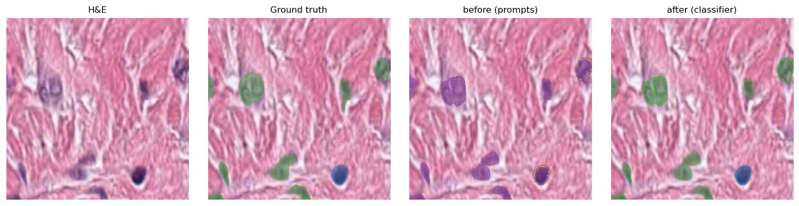
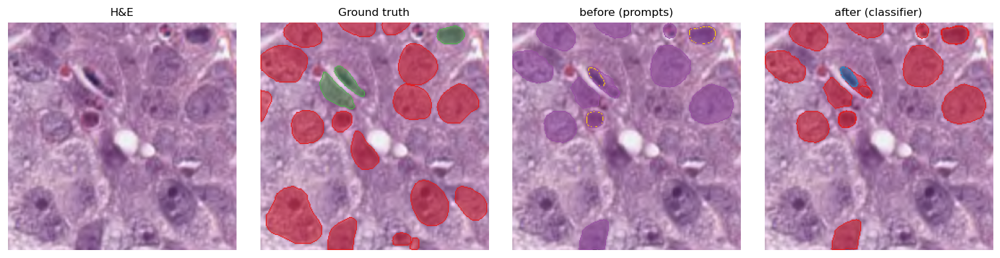
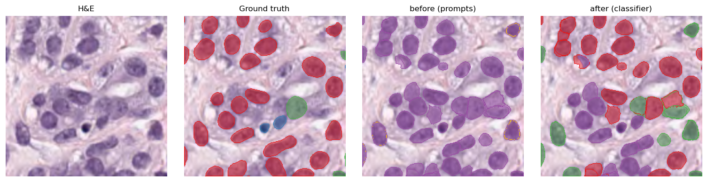
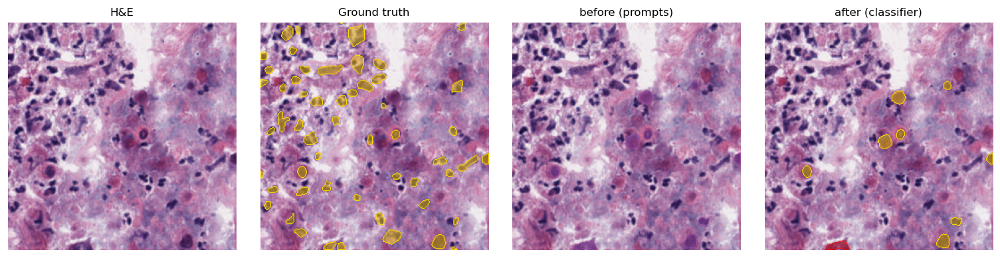
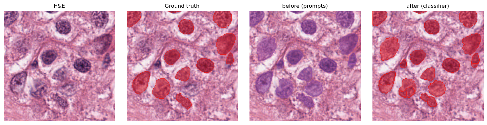
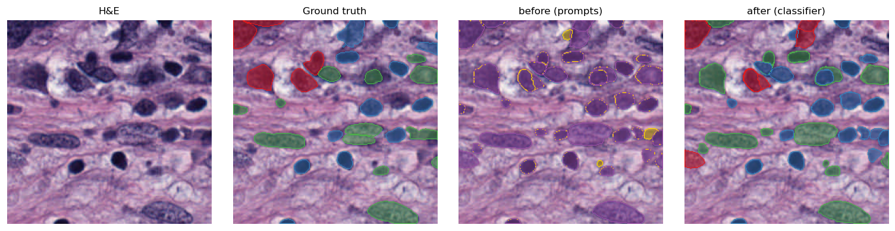

# SAM3 on PanNuke — text-concept nuclei segmentation

[**SAM3**](https://ai.meta.com/research/publications/sam-3-segment-anything-with-concepts/)
("Segment Anything with Concepts") is a **promptable concept segmentation** model: given a
short text concept it segments every matching instance end to end, with no separate
detector. Here it runs class-agnostically with the concept **`"cell nucleus"`**, and a
post-hoc UNI2-h + MLP classifier assigns each mask its subtype.

> Reproduce in the [`method_comparison_kaggle`](https://www.kaggle.com/code/marjan1111/comparison-of-different-vlms-on-pannuke)
> notebook, or locally with `python scripts/run_method.py sam3_text --classifier uni2h_mlp`.
> SAM3 is gated on Hugging Face ([`facebook/sam3`](https://huggingface.co/facebook/sam3)).

## Metrics

PanNuke fold1 sample, read against the ground-truth-box oracle (SAM2's ceiling):

| method | PQ | AJI | Dice | matched-IoU |
|---|---|---|---|---|
| oracle (ceiling) | 0.84 | 0.85 | 0.93 | 0.86 |
| SAM3 (text concept) | 0.37 | 0.49 | 0.64 | 0.84 |

SAM3 is the strongest **detector-free** method in the benchmark: its **matched-IoU (0.84)
sits just under the oracle (0.86)**, so the masks it returns are accurate — the PQ gap is
mostly nuclei it does not surface at the default threshold (lower `--threshold` to trade
precision for recall).

## Per-patch overlays — before / after the classifier

Each strip is **H&E · ground truth · before (SAM3 prompt labels) · after (UNI2-h classifier)**.
The concept prompt does not separate subtypes, so the "before" column collapses toward a
single class; the post-hoc classifier recovers the per-nucleus type in "after".

The full set of overlays is in [`results/sam3_text/overlays/`](results/sam3_text/overlays/),
and the side-by-side gallery against the oracle and OWLv2 is in the main
[README](README.md#results).
